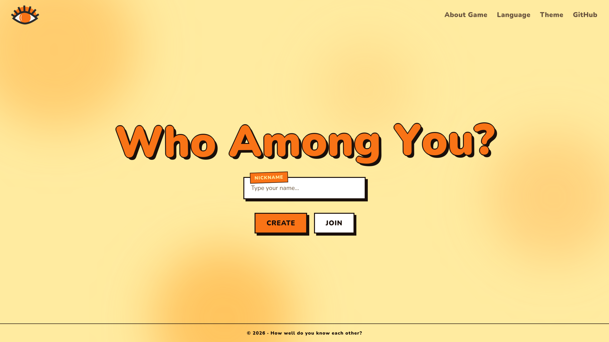
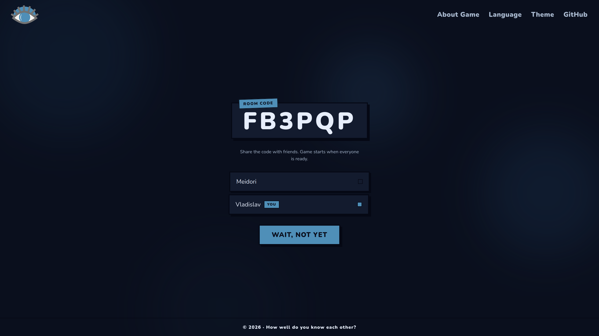
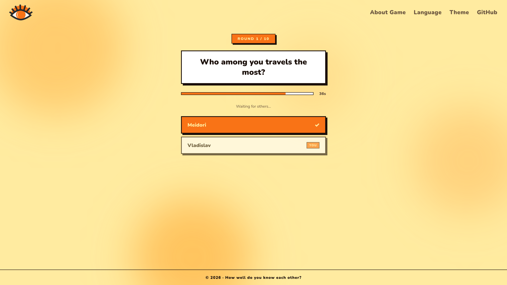
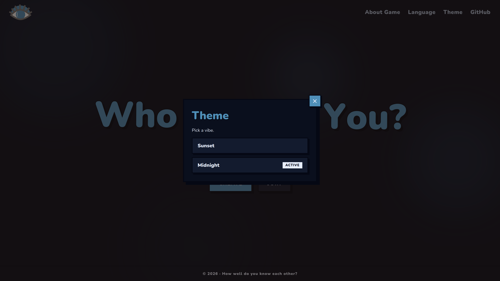
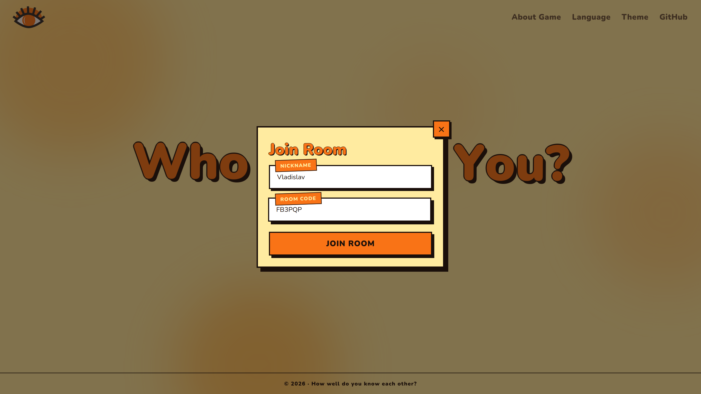

# Who Among You? 🕵️‍♂️

**Who Among You?** is a cozy, real-time multiplayer party game designed to help friends get to know each other better—or just have a great evening together. No apps, no installs—just open the link, share the room code, and start playing.

## 📸 Screenshots

| Sunset Theme | Midnight Theme |
| :---: | :---: |
|  |  |
|  |  |
|  | |

## ✨ Features

- **Real-time Gameplay:** Powered by WebSockets for instant interaction.
- **Room-based Lobbies:** Create a room, share the code, and wait for your friends to join.
- **Interactive Rounds:** Questions where players vote for who fits the description best.
- **Dynamic Themes:** Choose between "Sunset" (Light) and "Midnight" (Dark) vibes.
- **Multilingual:** Full support for English and Russian.
- **Mobile Friendly:** Responsive design that works great on phones and tablets.

## 🛠 Tech Stack

### Frontend
- **React 19** with **TypeScript**
- **Vite** for fast builds and HMR
- **React Router** for navigation
- **i18next** for localization
- **CSS Modules** for scoped styling

### Backend
- **Go 1.26**
- **Chi** for lightweight HTTP routing
- **Gorilla WebSocket** for real-time communication
- **UUID** for secure session and player identification

### Infrastructure
- **Docker & Docker Compose** for containerization
- **Caddy** as a reverse proxy with automatic HTTPS

## 🚀 Getting Started

### Prerequisites
- [Go 1.26+](https://go.dev/dl/)
- [Node.js](https://nodejs.org/) & [pnpm](https://pnpm.io/)
- [Docker](https://www.docker.com/) (optional, for containerized deployment)

### Local Development

1. **Clone the repository:**
   ```bash
   git clone https://github.com/your-username/who-among-you.git
   cd who-among-you
   ```

2. **Run the Backend:**
   ```bash
   cd backend
   go run cmd/who-among-you/main.go
   ```
   The API will be available at `http://localhost:8080`.

3. **Run the Frontend:**
   ```bash
   cd frontend
   pnpm install
   pnpm dev
   ```
   The app will be available at `http://localhost:5173`.

### Docker Deployment

To spin up the entire stack (Frontend + Backend + Caddy):

1. **Configure Environment:**
   Create a `.env` file from the example:
   ```bash
   cp .env.example .env
   ```
   Set your `DOMAIN` in the `.env` file.

2. **Start with Docker Compose:**
   ```bash
   docker-compose up --build -d
   ```

## 📂 Project Structure

```text
├── backend/            # Go source code
│   ├── cmd/            # Application entry point
│   ├── internal/       # Private library code (game logic, ws, http)
│   └── go.mod          # Go dependencies
├── frontend/           # React source code
│   ├── src/            # Components, hooks, contexts, i18n
│   ├── public/         # Static assets
│   └── package.json    # Frontend dependencies
├── Caddyfile           # Reverse proxy configuration
└── docker-compose.yml  # Container orchestration
```

## 📜 License

This project is licensed under the [MIT License](LICENSE).

---
*How well do you know each other?*
